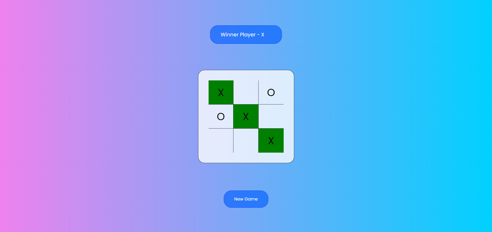

# Tic Tac Toe Game

Welcome to the Tic Tac Toe game project! This classic game allows two players to compete in a fun and strategic battle of Xs and Os.

](https://skimran-coder.github.io/TicTacToe/)

## Table of Contents

- [Introduction](#introduction)
- [Features](#features)
- [Technologies Used](#technologies-used)
- [Getting Started](#getting-started)
- [How to Play](#how-to-play)
- [Contributing](#contributing)

## Introduction

Tic Tac Toe, also known as Noughts and Crosses, is a popular paper-and-pencil game that has been brought to the digital world. This project aims to provide an engaging and interactive experience for users to enjoy the classic game online.

## Features

- **Play against a friend:** Invite a friend to compete with you.
- **Responsive Design:** Play on any device, from desktop to mobile.
- **Winning Pattern Highlight:** When a player wins, the winning pattern is highlighted.
- **Restart the Game:** Start a new game at any time.

## Technologies Used

- HTML
- CSS
- JavaScript
- Google Fonts
- GitHub Pages (for hosting)

## Getting Started

1. Clone the repository to your local machine:

   ```bash
   git clone https://github.com/your-username/tic-tac-toe.git
   ```

2. Open the project in your web browser:

   ```bash
   cd tic-tac-toe
   open index.html
   ```

## How to Play

1. Open the game in your browser.
2. Enter the names of Player 1 (X) and Player 2 (O).
3. Click on the boxes to take turns.
4. The game will highlight the winning pattern and declare the winner.
5. You can start a new game at any time by clicking the "New Game" button.

## Contributing

Contributions are welcome! If you'd like to add new features, improve the code, or fix bugs, please follow these steps:

1. Fork the repository.
2. Create a new branch for your feature or bug fix.
3. Make your changes.
4. Commit your changes.
5. Push your changes to your fork.
6. Create a pull request to the main repository.